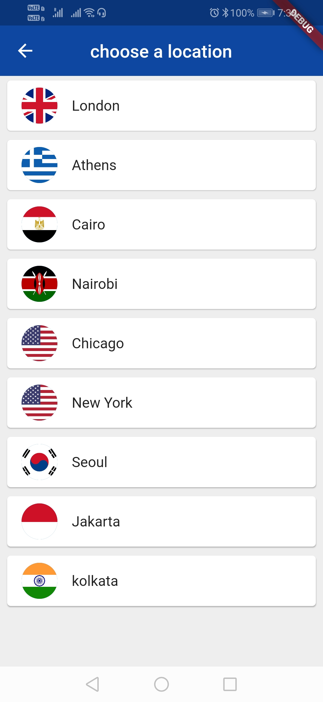

# world_time_app

A new Flutter application.

## Getting Started

The application tells you about the time in different countries all over the world. I have used the World Time API for making this app.

 

Technology Stack -

=> Dart 
